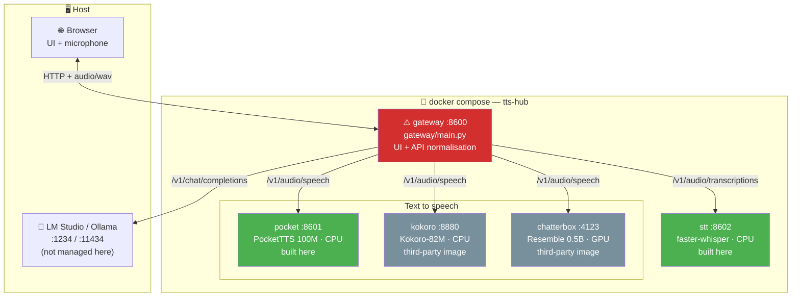

# TTS Hub — AGENTS.md

Local voice stack: three TTS engines and one STT engine behind a single gateway,
plus a conversation loop that bridges to any OpenAI-compatible LLM server.
Everything runs in Docker on the host machine. No cloud, no API keys.

## Overview

⚠️ = god node. See "High-risk files" below.

## Components

| Component | Location | Stack | Built here? |
|---|---|---|---|
| Gateway + UI | `gateway/` | FastAPI · httpx · vanilla JS | ✅ |
| PocketTTS wrapper | `engines/pocket/` | FastAPI · pocket-tts · torch CPU | ✅ |
| Whisper STT wrapper | `engines/stt/` | FastAPI · faster-whisper | ✅ |
| Kokoro | — | `ghcr.io/remsky/kokoro-fastapi-cpu` | ❌ image |
| Chatterbox | — | `travisvn/chatterbox-tts-api:gpu` | ❌ image |
| Orchestration | `docker-compose.yml` · `.env.example` | Compose v2 | ✅ |

## High-risk files (god nodes)

| File | Lines | Why risky |
|---|---|---|
| ⚠️ `gateway/main.py` | ~772 | Every route, every engine adapter, all WAV handling and the LLM bridge live here. Every other component depends on its HTTP contract. Touching it can break all five services at once. |
| ⚠️ `docker-compose.yml` | ~129 | Wires all services, ports, env vars, GPU reservation and healthchecks. A bad edit takes the whole stack down. |
| ⚠️ `gateway/static/index.html` | ~401 | Single-file UI consuming every gateway endpoint. No build step, no framework — a JS error blanks the page silently. |

**Rule**: never refactor `gateway/main.py` wholesale. Edit the named function only.

## Internal structure of gateway/main.py

| Section | Lines (approx) | Contents |
|---|---|---|
| Config + `SpeakRequest` | 1–97 | env vars, `ENGINES` registry, timeouts, segment sizing |
| Engine adapters | 99–175 | `_voices_*` per engine, `_payload` |
| WAV helpers | 177–248 | `_fix_wav_sizes`, `_decode_wav`, `_parse_wav_header`, `_open_wav_header` |
| Segmentation | 251–321 | `split_text`, `_JOBS`, `_prune_jobs`, `_supports_streaming` |
| Core routes | 324–412 | `/api/engines`, `/api/speak` |
| Progressive synthesis | 415–603 | `/api/segment`, `/api/speak/prepare`, `_segment_chunks`, `/api/speak/stream/{id}`, `/api/speak/file/{id}` |
| Conversation loop | 606–761 | `/api/transcribe`, `/api/chat`, `/api/converse`, `/api/services` |
| Static + health | 764–772 | `/health`, `/` |

## Progressive synthesis (shipped)

Segment-by-segment synthesis lets an `<audio>` element start playing before
the whole passage has been generated, instead of waiting for one complete
response.

- `split_text()` cuts text on sentence boundaries (`.!?…:;` and newlines),
  merges pieces shorter than `SEGMENT_MIN_CHARS` (60) and hard-splits pieces
  longer than `SEGMENT_MAX_CHARS` (280) on a comma, then a space.
  `SEGMENT_GAP_MS` (120 ms) of silence is inserted at each segment boundary.
- `POST /api/segment` previews the split without synthesising.
- `POST /api/speak/prepare` returns `{id, count, segments}` and registers a
  job in the in-memory `_JOBS` map (TTL 1800 s, capped at 20 entries, pruned
  by `_prune_jobs`).
- `GET /api/speak/stream/{job_id}` streams a chunked WAV, emitting exactly
  one RIFF header (placeholder `0xFFFFFFFF` sizes, by design) and yielding
  each PCM chunk the moment it arrives. For engines with a native streaming
  endpoint it relays that endpoint chunk by chunk; for the others it falls
  back to one complete request per segment (`_segment_chunks`).
- `GET /api/speak/file/{job_id}` returns the assembled audio afterwards as a
  proper WAV with correct RIFF sizes — the download path.
- The UI's "Progresiva" checkbox is default-checked and enabled for every
  online engine (the fallback covers engines without native streaming); it
  assigns the stream URL directly to `<audio>.src`, no blob buffering.
- `/api/speak` is unchanged and still serves the non-progressive path, used
  by the conversation tab and as the fallback when the toggle is off.

### Measured (851-char Spanish paragraph, 6 segments)

| engine | mode | time to first audio | total | duration |
|---|---|---|---|---|
| pocket | baseline | 18.63 s | 18.64 s | 48.24 s |
| pocket | progressive | 0.243 s | 18.95 s | 53.64 s |
| kokoro | baseline | 17.02 s | 17.02 s | 49.02 s |
| kokoro | progressive | 1.857 s | 13.29 s | 49.84 s |

PocketTTS starts 76.7× sooner, Kokoro 9.2× sooner.

> curl's `time_starttransfer` is **not** a valid measure of time-to-first-audio
> here: Starlette's `StreamingResponse` flushes HTTP headers before pulling
> the first item from the generator, so curl reports ~0.006 s regardless of
> whether any audio exists yet. The numbers above come from a probe that
> blocks on real body reads, cross-checked against the gateway's own
> `segment N/M ready at Xs` log lines.

### Known issues (open)

1. **MAJOR** — `engines/pocket/server.py` serves `/v1/audio/speech/stream`
   as a sync generator holding a `threading.Lock` for the whole generation. A
   client disconnect does not stop it: generation runs to completion
   server-side while holding the lock, stalling subsequent requests. This
   fires in normal use of progressive playback when the user hits generate
   again mid-stream. Not yet fixed.
2. **Minor** — `speak_file()` rebuilds the whole WAV via `wave.open` even
   for the UI's HEAD probe, then discards it. A lightweight status endpoint
   would avoid it.

### Known issues (diagnosed, accepted)

**PocketTTS progressive duration overshoot (+11.2%)** — diagnosed and closed
as accepted-by-design; not a bug.

Root cause: `pocket_tts.TTSModel.generate_audio()` is a thin wrapper that
calls `generate_audio_stream()` over the whole input and concatenates the
result. Both HTTP routes therefore share identical behaviour and the same
`frames_after_eos=None` default — there is no parameter mismatch between
them. Internally `generate_audio_stream()` calls
`split_into_best_sentences()`, which packs sentences into chunks of up to
`MAX_TOKEN_PER_CHUNK=50` tokens — a pocket-tts library constant, unrelated to
the gateway's `SEGMENT_MAX_CHARS`. Every internal chunk pays a trailing
silence-after-EOS cost of roughly 240–400 ms nominal, stochastic in practice
(100–850 ms observed) because generation samples at `temp=0.7`. Splitting a
passage into N independent HTTP calls restarts that packer N times, so more
chunk boundaries means more EOS padding.

Isolated measurement, with no gateway or `SEGMENT_GAP_MS` involved: the same
418-character, 4-sentence text sent as one `/v1/audio/speech/stream` call
averaged 27.3 s over 3 runs; sent as 4 independent calls it averaged 29.5 s.
Waveform inspection confirms the tails are true digital silence (RMS ~1-2
versus ~1500-2600 for speech), not soft trailing phonemes.

Decision: accepted. Neither available fix was safe. Lowering
`frames_after_eos` on the streaming route would change behaviour for every
caller and risks clipping real phonemes, since that padding is an
anti-clipping margin. Trimming the tail in `_segment_chunks` would require
holding back a variable, sometimes large tail per segment until the
generator ends, which is exactly the buffering that would destroy the
0.243 s time-to-first-byte the feature exists for.

Future option (not done, out of scope): decouple the unit sent to the engine
from the UI's playback segment size, so engines with native streaming
receive fewer, larger calls. For PocketTTS specifically, a single
native-stream call over the whole text would give the same low
time-to-first-byte with no extra silence at all, since its native endpoint
already streams incrementally. That is a segmentation-policy change on a god
node and was deliberately left out of scope.

## Cross-cutting invariants

Break any of these and the stack fails in ways that are hard to trace:

1. **Every engine answers `audio/wav`, mono, 16-bit PCM.** All three happen to run at 24 kHz, but never hardcode the rate — read it from the WAV header.
2. **Kokoro sends complete responses with streaming-style RIFF sizes** (`0xFFFFFFFF`). Anything that parses its output must go through `_fix_wav_sizes` first, or the browser reports ~89 000 s of duration.
3. **Engine capabilities are discovered, never assumed.** `_supports_streaming` reads the engine's `openapi.json`. The Chatterbox `:gpu` tag has neither `/voices` nor a streaming endpoint; newer tags do.
4. **PocketTTS is not thread-safe.** `engines/pocket/server.py` serialises generation behind a lock. Concurrent requests queue; they do not fail.
5. **The gateway is stateless about conversations.** Chat history lives in the browser and is posted per turn. Only `_JOBS` holds server state, and it is TTL-pruned.

## Available skills

None defined in this project yet. Candidates: `tts-smoke-test` (bring the
stack up and benchmark all engines), `engine-add` (register a fourth TTS
engine end to end).

## Conventions

- **Code and comments**: English. **User-facing UI text and README**: Spanish.
- **Commits**: conventional commits, English, body explains *why*.
- **Everything in Docker.** Never install a model runtime on the host.
- **Ports**: gateway 8600, pocket 8601, stt 8602, kokoro 8880, chatterbox 4123.
  Chosen to avoid collisions with the host's Klipper/Moonraker/Ollama stack.
- Mermaid diagrams over narrative prose for anything structural.
