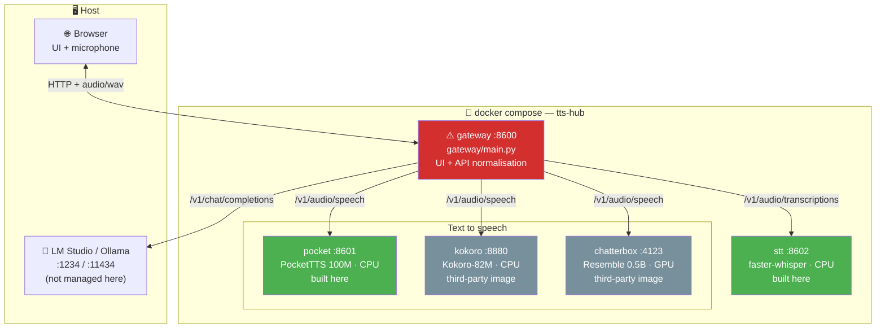

# TTS Hub — AGENTS.md

Local voice stack: three TTS engines and one STT engine behind a single gateway,
plus a conversation loop that bridges to any OpenAI-compatible LLM server.
Everything runs in Docker on the host machine. No cloud, no API keys.

## Overview

⚠️ = god node. See "High-risk files" below.

## Components

| Component | Location | Stack | Built here? |
|---|---|---|---|
| Gateway + UI | `gateway/` | FastAPI · httpx · vanilla JS | ✅ |
| PocketTTS wrapper | `engines/pocket/` | FastAPI · pocket-tts · torch CPU | ✅ |
| Whisper STT wrapper | `engines/stt/` | FastAPI · faster-whisper | ✅ |
| Kokoro | — | `ghcr.io/remsky/kokoro-fastapi-cpu` | ❌ image |
| Chatterbox | — | `travisvn/chatterbox-tts-api:gpu` | ❌ image |
| Orchestration | `docker-compose.yml` · `.env.example` | Compose v2 | ✅ |

## High-risk files (god nodes)

| File | Lines | Why risky |
|---|---|---|
| ⚠️ `gateway/main.py` | ~737 | Every route, every engine adapter, all WAV handling and the LLM bridge live here. Every other component depends on its HTTP contract. Touching it can break all five services at once. |
| ⚠️ `docker-compose.yml` | ~129 | Wires all services, ports, env vars, GPU reservation and healthchecks. A bad edit takes the whole stack down. |
| ⚠️ `gateway/static/index.html` | ~401 | Single-file UI consuming every gateway endpoint. No build step, no framework — a JS error blanks the page silently. |

**Rule**: never refactor `gateway/main.py` wholesale. Edit the named function only.

## Internal structure of gateway/main.py

| Section | Lines (approx) | Contents |
|---|---|---|
| Config + `SpeakRequest` | 1–97 | env vars, `ENGINES` registry, timeouts, segment sizing |
| Engine adapters | 99–175 | `_voices_*` per engine, `_payload` |
| WAV helpers | 177–252 | `_fix_wav_sizes`, `_decode_wav`, `_parse_wav_header`, `_open_wav_header` |
| Segmentation | 254–322 | `split_text`, `_JOBS`, `_prune_jobs`, `_supports_streaming` |
| Core routes | 324–413 | `/api/engines`, `/api/speak` |
| Progressive synthesis | 415–570 | `/api/segment`, `/api/speak/prepare`, `/api/speak/stream/{id}`, `/api/speak/file/{id}`, `_segment_chunks` |
| Conversation loop | 572–728 | `/api/transcribe`, `/api/chat`, `/api/converse`, `/api/services` |
| Static + health | 730–737 | `/health`, `/` |

## Known broken state (2026-07-23)

Progressive synthesis is **mid-refactor and the gateway does not start**:

- `produce()` inside `speak_stream` (~line 512) still calls `_synthesise_segment()`
- that function was replaced by the async generator `_segment_chunks()` (~line 453)
- the UI has not been updated: it still does `await res.blob()`, so nothing plays progressively even for PocketTTS, which has native streaming

Fixing this is the current task. Do not treat the file as a working baseline.

## Cross-cutting invariants

Break any of these and the stack fails in ways that are hard to trace:

1. **Every engine answers `audio/wav`, mono, 16-bit PCM.** All three happen to run at 24 kHz, but never hardcode the rate — read it from the WAV header.
2. **Kokoro sends complete responses with streaming-style RIFF sizes** (`0xFFFFFFFF`). Anything that parses its output must go through `_fix_wav_sizes` first, or the browser reports ~89 000 s of duration.
3. **Engine capabilities are discovered, never assumed.** `_supports_streaming` reads the engine's `openapi.json`. The Chatterbox `:gpu` tag has neither `/voices` nor a streaming endpoint; newer tags do.
4. **PocketTTS is not thread-safe.** `engines/pocket/server.py` serialises generation behind a lock. Concurrent requests queue; they do not fail.
5. **The gateway is stateless about conversations.** Chat history lives in the browser and is posted per turn. Only `_JOBS` holds server state, and it is TTL-pruned.

## Available skills

None defined in this project yet. Candidates once the current work lands:
`tts-smoke-test` (bring the stack up and benchmark all engines), `engine-add`
(register a fourth TTS engine end to end).

## Conventions

- **Code and comments**: English. **User-facing UI text and README**: Spanish.
- **Commits**: conventional commits, English, body explains *why*.
- **Everything in Docker.** Never install a model runtime on the host.
- **Ports**: gateway 8600, pocket 8601, stt 8602, kokoro 8880, chatterbox 4123.
  Chosen to avoid collisions with the host's Klipper/Moonraker/Ollama stack.
- Mermaid diagrams over narrative prose for anything structural.
